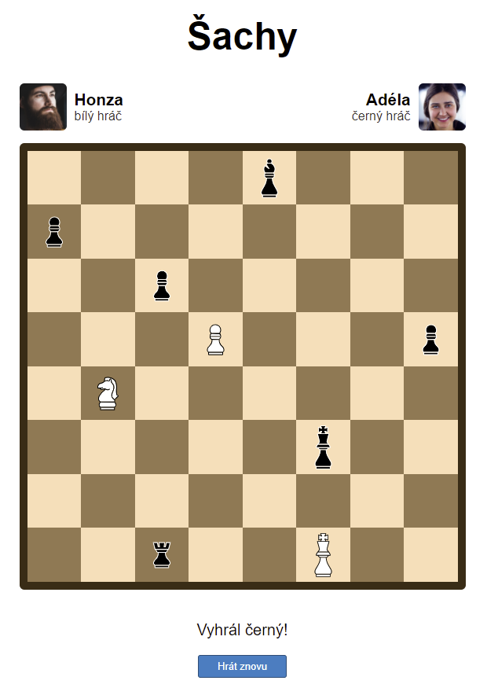
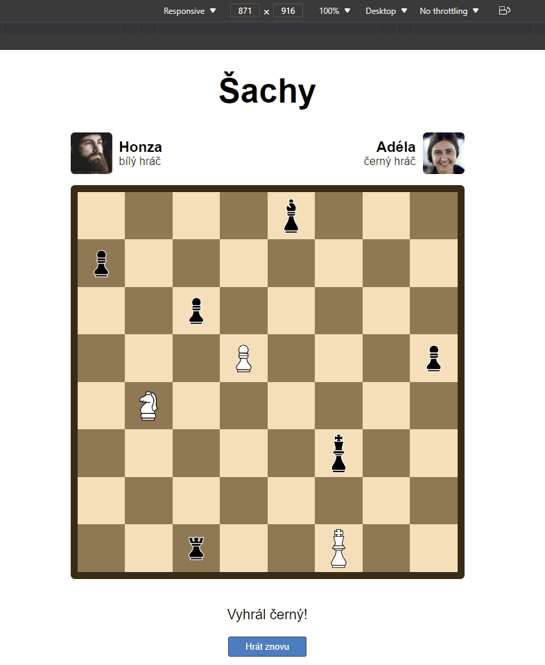

# Úkol: Šachy

Nastyluj stránku podle ukázky níže.

- Obrázky figurek, hráčů a šachovnice najdeš ve složce `obrazky`.
- Obsahovým obrázků nezapomeň nastavit atribut `alt`.
- Stránka by měla být responzivní. Omez maximální šířku obsahu na `600px`.
- Pozice figurek nastav pomocí `grid` vlastností.

